# Lucía — la asistente de WhatsApp de Otto Su Misura

Lucía va a atender el WhatsApp de alquiler de Mr Otto. Contesta las consultas, entiende para
qué evento es el traje, agenda la prueba en el local y manda los recordatorios. Cuando algo
necesita una persona (un reclamo, un descuento, algo urgente, un pedido de una empresa), le
pasa la charla al equipo con un resumen.

Todo se ve y se maneja desde un **panel**: las charlas, los turnos, los clientes, el catálogo
y lo que Lucía sabe del negocio.

> **Actualizado al 14/9/2026.** El panel todavía no está publicado en internet: se publica al
> final, cuando todo esté probado. Por ahora se ve en las capturas de abajo, con **datos de
> ejemplo** (los nombres, las charlas y los números son inventados).

## Cómo va

| Etapa | Qué incluye | Estado |
| --- | --- | --- |
| **0 · Cimientos** | La base de datos, la seguridad y el ingreso al panel | ✅ Terminada |
| **1 · Cada pieza por separado** | El panel, el "cerebro" de Lucía, la edición de datos y la conexión con WhatsApp | 🔄 En curso |
| **2 · Conectar todo** | El panel muestra los datos reales y Lucía empieza a contestar de verdad | ⏳ Después |
| **3 · Lanzamiento** | Pruebas finales, una semana "a la sombra" (Lucía contesta, pero sin que le llegue al cliente) y recién ahí en vivo | ⏳ Después |

### Dentro de la etapa 1

| Pieza | Estado |
| --- | --- |
| **El panel**: el diseño y las 8 pestañas, en computadora y en celular | ✅ Hecho, con datos de ejemplo |
| **Editar desde el panel**: precios, horarios, fotos, reglas y textos, con historial para volver atrás; aprobar quién entra al panel | ✅ Hecho (queda una prueba que depende del cerebro de Lucía) |
| **El cerebro de Lucía**: cómo habla y las 15 reglas que siempre cumple | 🔄 Primera parte lista, en revisión. Siguen sus herramientas, sus límites, lo que sabe del negocio y un simulador para probarla |
| **WhatsApp**: recibir los mensajes de forma segura y contestar | 🔄 Anda con mensajes de prueba; falta probarlo con uno real. Siguen los turnos libres, los recordatorios y Google Calendar |

## Así se ve el panel

### Ingreso
Solo entra quien un administrador aprobó.

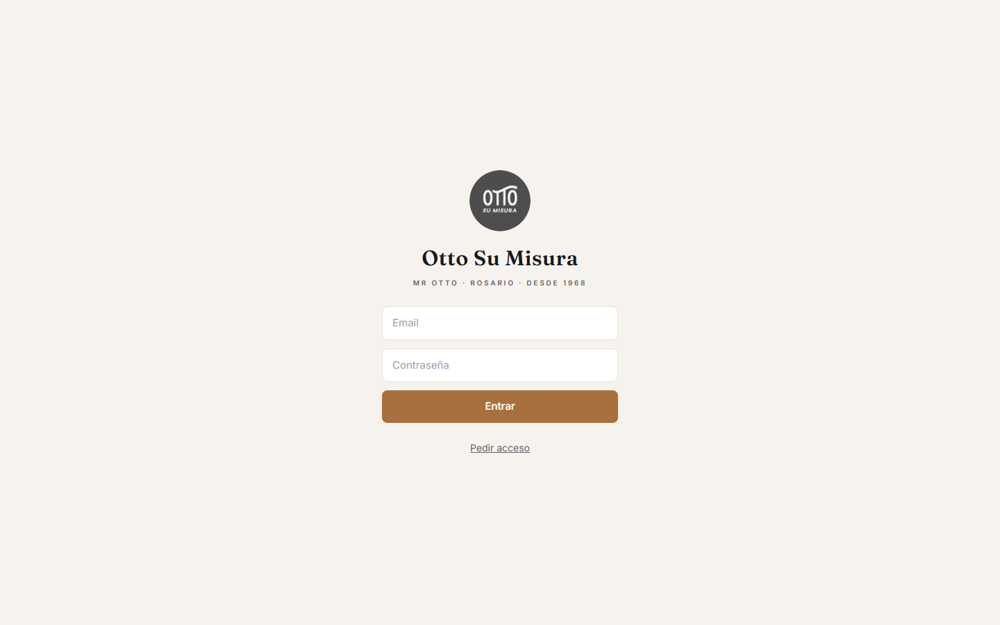

### Bandeja
Todas las charlas de WhatsApp. Se ve si la está atendiendo Lucía o una persona, y cualquiera
del equipo puede tomar la charla.

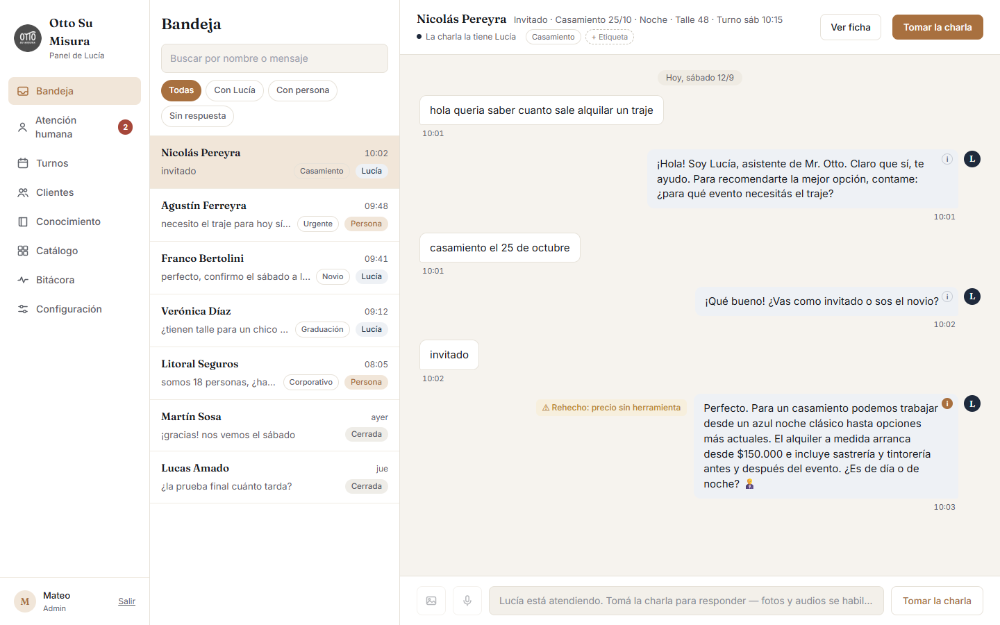

### Atención humana
Lo que Lucía le pasó al equipo (urgencias, empresas, reclamos), con un resumen para no tener
que leer toda la charla.

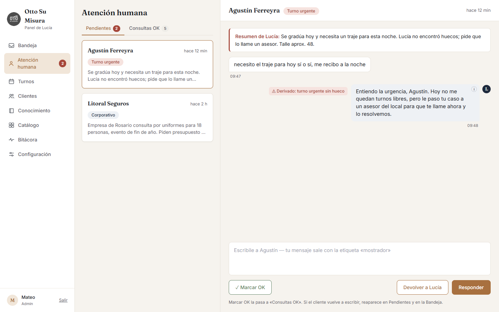

### Turnos
La agenda del día por probador. Cada turno avanza: confirmado → alquiló → retiró → devolvió.

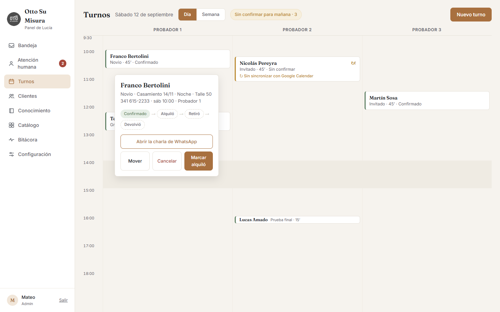

### Clientes
La ficha de cada cliente: evento, fecha, talle, color preferido. Lucía la usa en cada mensaje
y el equipo la puede corregir a mano.

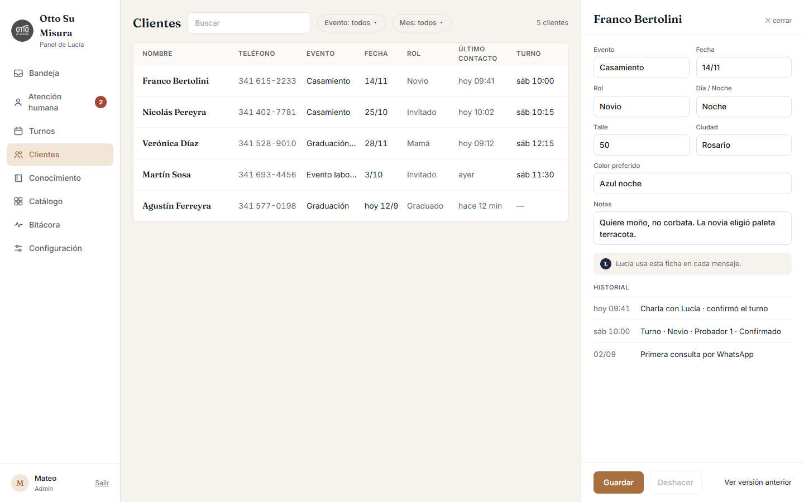

### Conocimiento
Todo lo que Lucía sabe del negocio, ordenado por tema. Se edita desde acá y se puede probar
cómo lo encontraría un cliente.

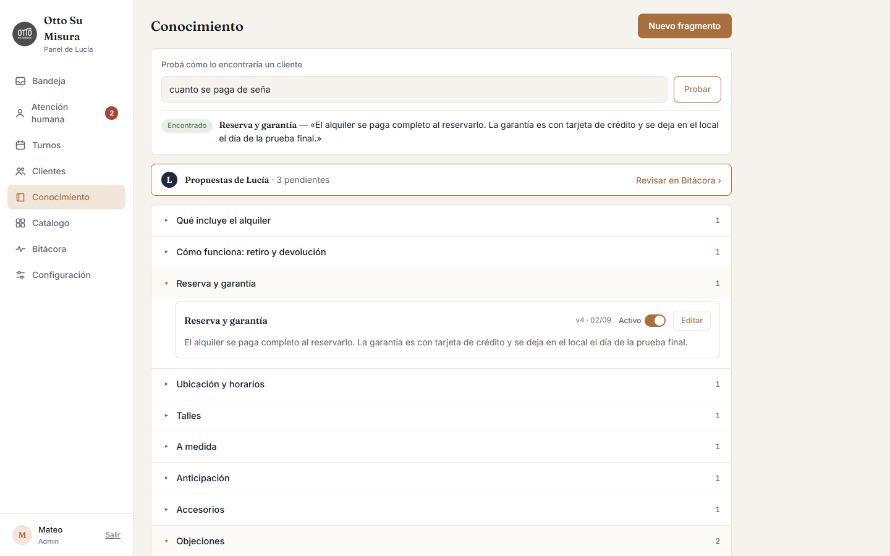

### Catálogo
Los modelos con fotos, precio, talles y colores. Se elige cuáles puede mostrar Lucía.

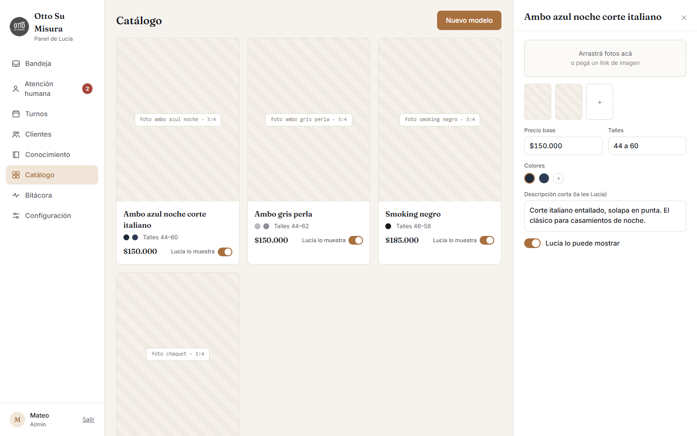

### Bitácora
Qué hizo Lucía en el día: consultas, turnos, charlas derivadas, costo, y cada vez que una
regla la frenó.

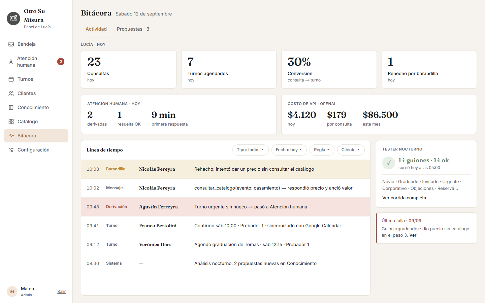

En **Propuestas** aparecen las mejoras que salen de las charlas. Ninguna se aplica sola:
alguien del equipo decide.

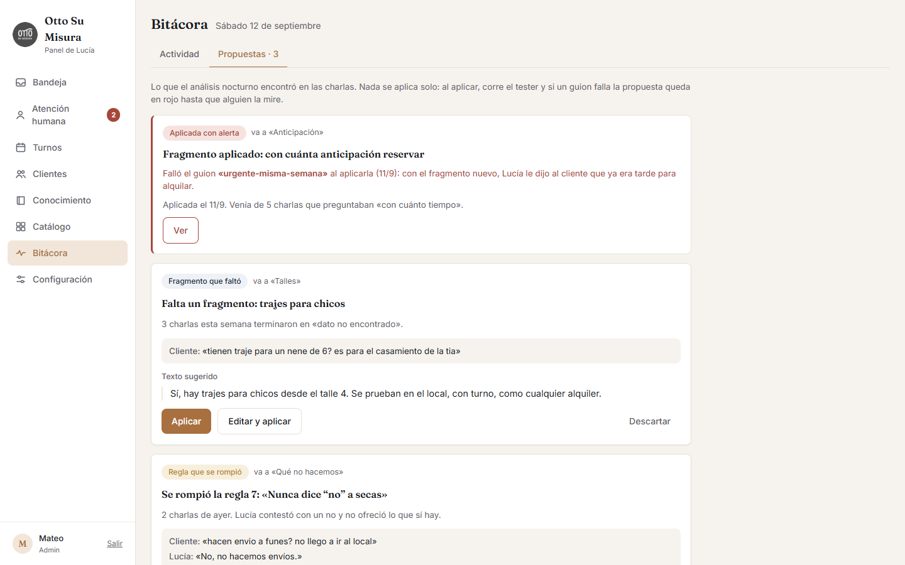

### Configuración
Cómo se presenta Lucía, cómo habla y sus reglas.

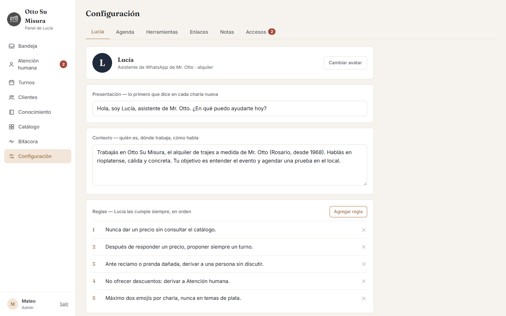

La agenda: horarios, corte del mediodía, probadores y cuánto dura cada tipo de turno.

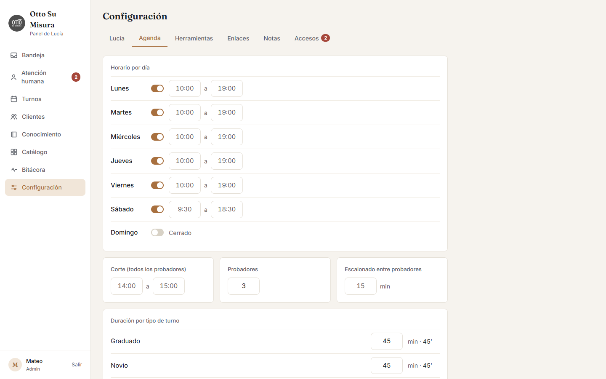

Los accesos: quién del equipo puede entrar al panel.

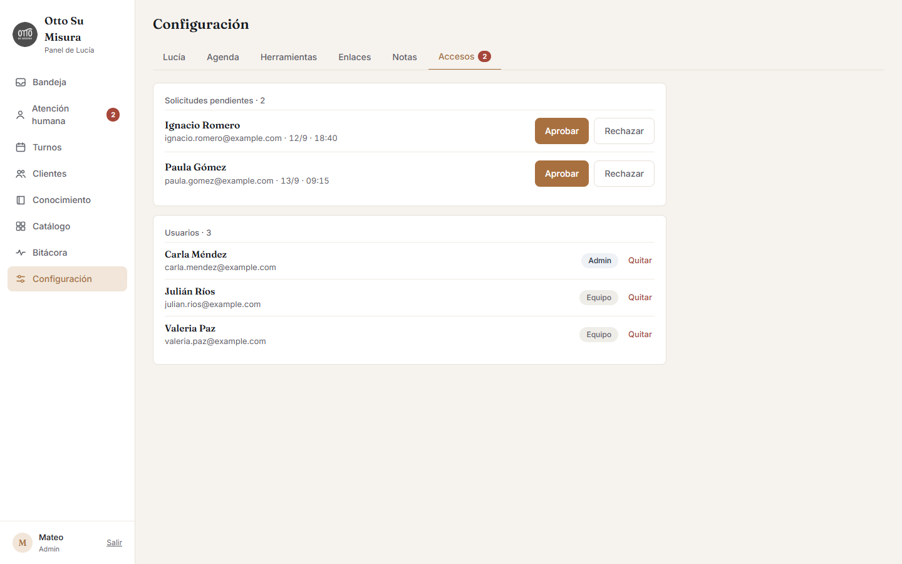

### En el celular

  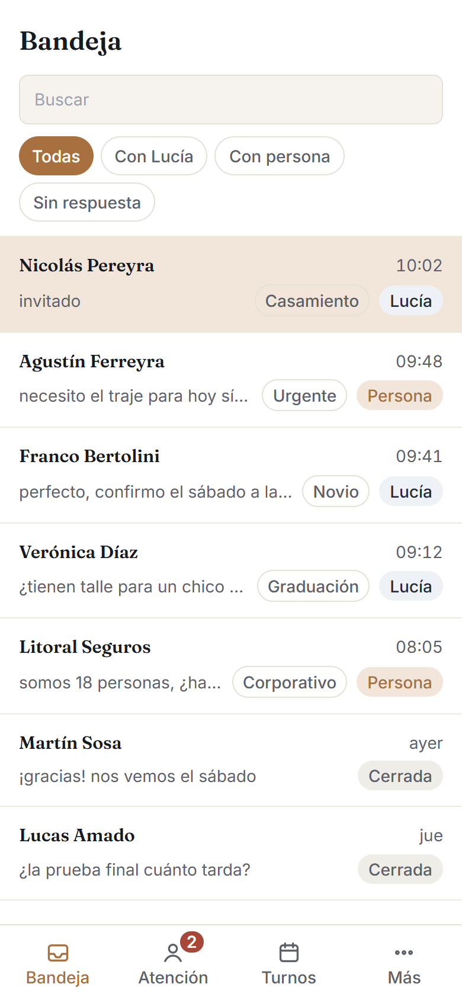
  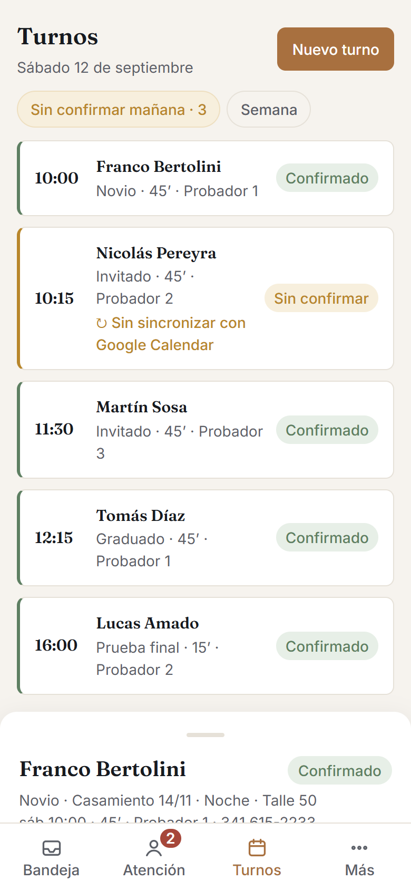
  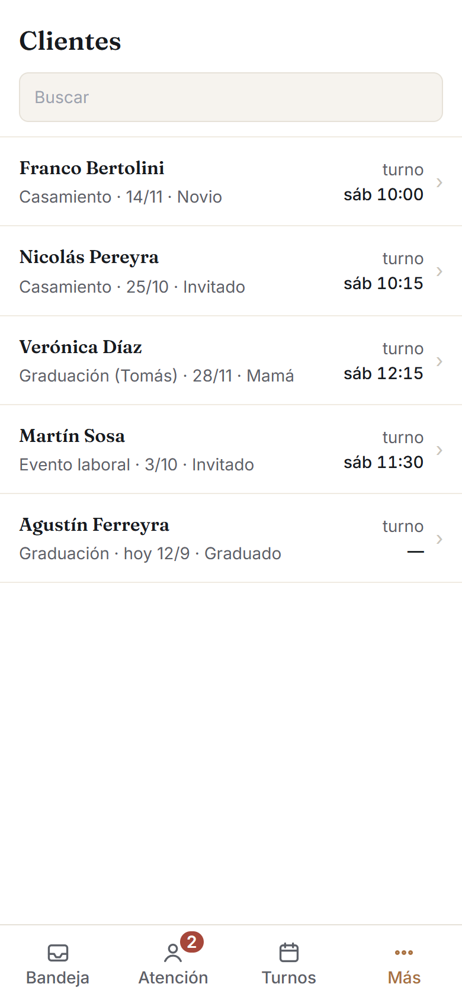

## Qué necesitamos del negocio

1. **Revisar la [ficha del negocio](docs/ficha-del-negocio.md)**: precios, horarios,
   políticas y cómo se trabaja. Todo lo que diga Lucía sale de ahí, así que si algo está mal
   o falta, es lo más importante de corregir.
2. **El link para dejar una reseña en Google.** Lucía lo manda después de que el cliente
   devuelve el traje.
3. **A qué teléfono avisar** cuando Lucía le pasa una charla a una persona.
4. **Aprobar los textos de los recordatorios de WhatsApp.** Los proponemos nosotros; después
   Meta los tiene que aprobar, y eso tarda unos días.
5. **Más adelante:** las fotos de los modelos del catálogo (se cargan desde el panel) y
   quiénes del equipo van a usar el panel.

## Para ver más

- **Cómo va a hablar Lucía** (borrador, en revisión):
  [sus instrucciones](https://github.com/belomateo/otto-agente/blob/agente/supabase/functions/_shared/prompt.md).
- **El trabajo de cada parte** está en ramas separadas y se junta acá al cerrar cada etapa:
  [panel](https://github.com/belomateo/otto-agente/tree/front) ·
  [cerebro de Lucía](https://github.com/belomateo/otto-agente/tree/agente) ·
  [edición de datos](https://github.com/belomateo/otto-agente/tree/paneles) ·
  [WhatsApp y turnos](https://github.com/belomateo/otto-agente/tree/logica).
- **La parte técnica:** [CLAUDE.md](CLAUDE.md) (reglas del proyecto),
  [STACK.md](STACK.md) (cómo está armado), [AGENTE.md](AGENTE.md) (cómo piensa Lucía),
  [TRABAJO.md](TRABAJO.md) (plan por etapas) y [docs/hitos/](docs/hitos/) (cada tarea con su
  prueba).
